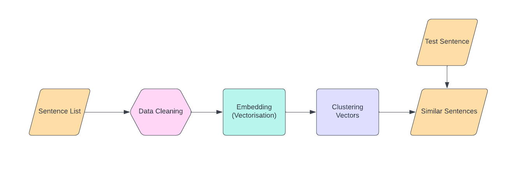

# TextClustering596E
This project is part of Individual project done as a part of Independent Study under Brian Levine and Prasanna Kumar. 

|
|:--:|
| <b> Fig.1 - Architecture</b>|

## Dependencies
To install dependencies execute the following command

    pip install -r requirements.txt

## Usage
To Encode the Dataset and save it in Encoded Dataset please follow the below command (if you're doing for the first time) 

    python main.py

To evaluate the clustring process please run the server and client in two different terminals

    python server.py
    python client.py

